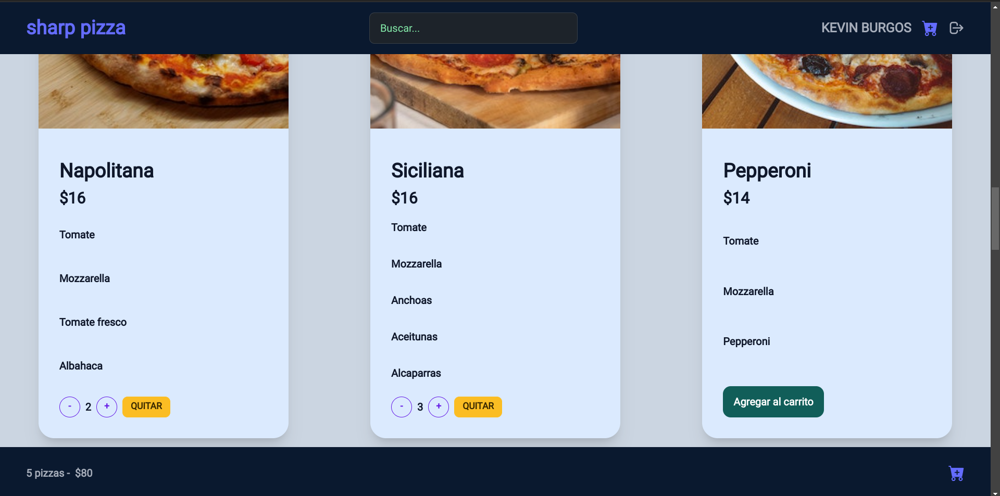

<br />

<div align="center">


<br />
<div align="center">

  <a href="No-Country/c14-46-m-csharp-react" target="_blank">
    
  </a>

<h3 align="center">Sharp Pizza</h3>

  <p align=center">
    Sharp-Pizza es una aplicación para el pedido de pizzas a domicilio con posibilidad de pago en efectivo al delivery o con tarjeta de crédito dentro de la misma app. Para usar la app el usuario debe registrarse y crear una cuenta.
    <br />
    <br />
    <a href="https://c14-46-m-csharp-react.vercel.app/" target="_blank">Ver Demo</a>
    ·
    <a href="https://github.com/No-Country/c14-46-m-csharp-react/issues" target="_blank">Reportar Bug</a>
  </p>
</div>


<h1 align="center"> 
Acerca del Proyecto
</h1>


<p align='left'>Pizza Sharp es mucho más que un simple negocio de comida. Es el resultado de un sueño que comenzó hace décadas, cuando nuestro abuelo Ennio, un inmigrante italiano lleno de pasión y determinación, llegó a este país con la receta secreta de la auténtica pizza italiana. A través de los años, nuestra pizzería ha crecido y se ha convertido en un lugar donde la tradición, la calidad y el sabor se funden en cada bocado.</p>

<p align='left'>Con el paso de las generaciones, la pizzería ha experimentado cambios y mejoras para adaptarse a los gustos cambiantes y a las nuevas tendencias culinarias. Se agregaron nuevas variedades de pizza, se introdujeron opciones vegetarianas y se amplió el menú a pedido de nuestros clientes. Sin embargo, siempre se ha mantenido la esencia original: la autenticidad y la calidad.</p>
<p align='left'>La historia de crecimiento de Pizza Sharp es un testimonio del esfuerzo, la pasión y el amor por la comida que nuestro abuelo Ennio nos transmitió. A través de los años, hemos crecido y evolucionado, pero siempre hemos mantenido las raíces y los valores que nos han hecho exitosos. Pizza Sharp es más que un lugar para disfrutar de una buena comida; es un símbolo de la unión de nuestra familia y de la tradición culinaria italiana que nos enorgullece compartir con nuestros clientes.</p>
<p align='left'>En nombre de toda la familia de Pizza Sharp nos gustaría expresar nuestro más sincero agradecimiento por elegir nuestros productos a través de nuestra aplicación. Su confianza y apoyo continuo son los pilares fundamentales de nuestro negocio y nos llena de alegría poder brindaros la auténtica experiencia de la pizza italiana en la comodidad de sus hogares.</p>

<h1 align="center"> 
Tecnologias Utilizadas
</h1>


<h1 align="center"> 
Herramientas para la Organización de Tareas
</h1>

<a href="https://trello.com/b/Q0G3my8O/sb-klinika" target="_blank">
  
</a>

<a href="https://www.nocountry.tech/" target="_blank">
  
</a>

<a href="https://discord.gg/Zj2GmPwg" target="_blank">
  
</a>


<h1 align="center"> 
Instrucciones para ejecutar la app
</h1>

Instrucciones para clonar el repo y ejecutar el proyecto localmente: 

Clonar este repositorio y ejecuta "npm install" y luego "npm run dev" desde la terminal.
   ```sh
   git clone https://github.com/No-Country/c14-46-m-csharp-react.git
   ```

O simplemente clickea en el link de 
<a href="https://c14-46-m-csharp-react.vercel.app/" target="_blank">Ver Demo.</a>

<h1 align="center"> 
Guía Básica de uso
</h1>

<p align='left'>Desde el Home es posible acceder al menu para ver la variedad de pizzas disponibles. Pero en caso de que el visitante desee agregar una pizza al carrito se lo redireccionara a la pagina de login donde debe loguearse con sus datos. En caso de no contar con cuenta, existe link que lleva a la pagina de registro.</p> 
<p align='left'>Ya con el usuario logueado es posible comenzar a agregar pizzas al carrito. Una vez que el cliente esta satisfecho con la seleccion podra acceder al carrito donde se detalla variedad de items seleccionado y precios. Desde esa pantalla puede ajustar la cantidad de cada producto o incluso eliminarlo. Incluso es posible volver al menu principal para revisar otras variedades y retornar en cualquier momento.</p> 
<p align='left'>En caso de que los datos del carrito son los requeridos por el usuario, tiene la opcion de proceder a crear y confirmar la order. Las opciones son con pago en efectivo al delivery o procesar el pago con targeta desde la misma app. 
Si los datos son procesados correctamente, un mensaje emergente confirmado que el proceso fue exitoso y se regresa al menu ya con el carrito vacio.</p> 
<p align='left'>En caso de que el usuario se desloguea, los datos se resetean y la app redirije al home.</p> 


<h1 align="center"> 
Equipo
</h1>

<table>
  <tr>
    <td>
      <div align="center">
        <a href="https://github.com/Theo1982" target="_blank" rel="author">
          
        </a>
        <a href="https://github.com/Theo1982" target="_blank" rel="author">
          <h4 style="margin-top: 1rem;">Octavio Macchi</h4>
          <h4 style="margin-top: 1rem;">Back-end Developer</h4>
        </a>
        <a href="https://github.com/Theo1982" target="_blank">
          
        </a>
        <a href="https://www.linkedin.com/in/octavio-macchi-767762242/  " target="_blank">
          
        </a>
      </div>
    </td>
    <td>
      <div align="center">
        <a href="https://github.com/Mecht21" target="_blank" rel="author">
          
        </a>
        <a href="https://github.com/Mecht21" target="_blank" rel="author">
          <h4 style="margin-top: 1rem;">Daniel Serrano</h4>
          <h4 style="margin-top: 1rem;">Back-end Developer</h4>
        </a>
        <a href="https://github.com/Mecht21" target="_blank">
          
        </a>
        <a href="https://www.linkedin.com/in/daniel-serrano-vega/" target="_blank">
          
        </a>
      </div>
    </td>
    <td>
      <div align="center">
        <a href="https://github.com/Kev-Villegas" target="_blank" rel="author">
          
        </a>
        <a href="https://github.com/Kev-Villegas" target="_blank" rel="author">
          <h4 style="margin-top: 1rem;">Kevin Villegas</h4>
          <h4 style="margin-top: 1rem;">Front-end Developer</h4>
        </a>
        <a href="https://github.com/Kev-Villegas" target="_blank">
          
        </a>
        <a href="https://www.linkedin.com/in/kevin--villegas/" target="_blank">
          
        </a>
      </div>
    </td>
    <td>
      <div align="center">
        <a href="https://github.com/pinoen" target="_blank" rel="author">
          
        </a>
        <a href="https://github.com/pinoen" target="_blank" rel="author">
          <h4 style="margin-top: 1rem;">Emilio Pino</h4>
          <h4 style="margin-top: 1rem;">Front-end Developer</h4>
        </a>
        <a href="https://github.com/pinoen" target="_blank">
          
        </a>
        <a href="https://www.linkedin.com/in/emiliopino/" target="_blank">
          
        </a>
      </div>
    </td>
  </tr>
</table>


<h1 align="center"> 
Video
</h1>


<p align="center"><a href="" target="_blank" rel="noopener noreferrer"></a></p>


<h1 align="center"> 
Capturas de Pantalla de las diferentes Páginas
</h1>





<h1 align="center"> 
Agradecimientos
</h1>

[No Country](https://www.nocountry.tech/)